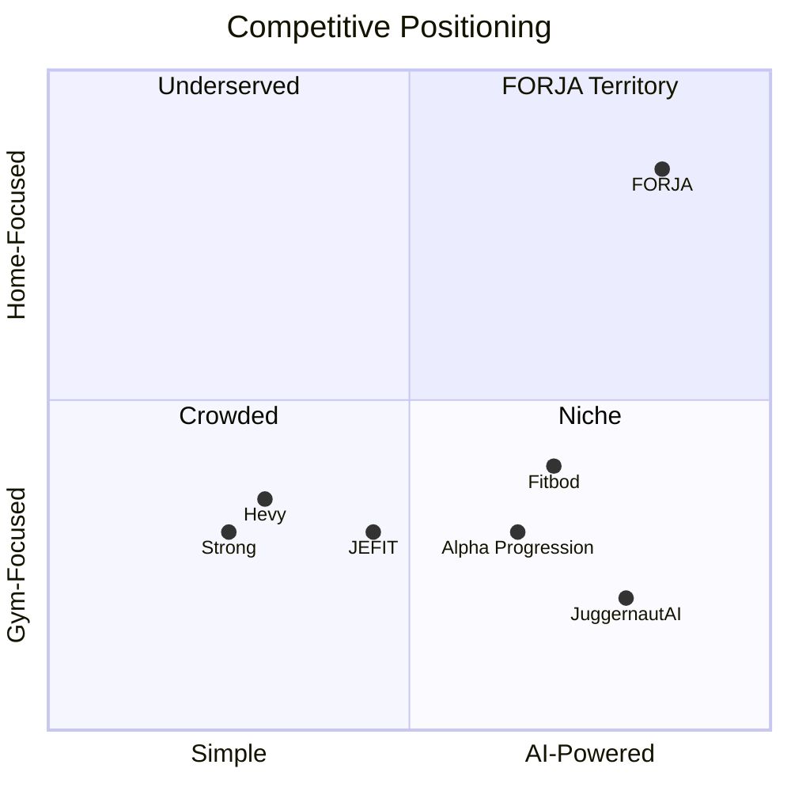

# 🏋️ AI Home Gym Planner — Phân Tích Chiến Lược & Ý Tưởng Peak

> **Mục tiêu**: Ứng dụng AI quản lý & lập kế hoạch tập Gym tại nhà. Đa nền tảng (iOS + Android). UI/UX đủ premium để bán trên UI8/ThemeForest. Tính năng AI agentic độc lạ, đủ sức cạnh tranh trên App Store/CH Play.

---

## 1. Bối Cảnh Thị Trường 2025–2026

### 1.1 Xu hướng chủ đạo

| Xu hướng                  | Mô tả                                                                                                                   |
| :------------------------ | :---------------------------------------------------------------------------------------------------------------------- |
| **Agentic AI**            | AI không chỉ gợi ý — nó **tự hành động** thay user. User đặt mục tiêu, AI tự lập kế hoạch, tự điều chỉnh, tự cảnh báo.  |
| **Hyper-Personalization** | Cá nhân hóa từ trước: quiz 1 lần → bây giờ: **điều chỉnh hàng ngày** dựa trên giấc ngủ, recovery, stress, lịch cá nhân. |
| **Hybrid Coach Model**    | AI xử lý phần operational (lập plan, track tiến trình, nhắc nhở) → Human coach focus vào phần chuyên sâu.               |
| **Ecosystem Integration** | Data chảy liền mạch giữa wearables, thiết bị gym, app → unified health profile.                                         |
| **Physical AI**           | Thiết bị tập thông minh: camera 3D chỉnh form, resistance tự điều chỉnh.                                                |

### 1.2 Đối thủ cạnh tranh chính

| App                   | Điểm mạnh                                                  | Điểm yếu                         |
| :-------------------- | :--------------------------------------------------------- | :------------------------------- |
| **Fitbod**            | Recovery-based AI, tự generate workout, 900+ bài tập       | UI generic, không focus home gym |
| **JEFIT**             | 1400+ bài tập, community lớn, tracking sâu                 | UI cũ, quá phức tạp cho beginner |
| **Alpha Progression** | Science-based hypertrophy, progressive overload thông minh | Chỉ focus muscle building        |
| **JuggernautAI**      | Powerlifting chuyên sâu, periodization chuẩn               | Niche hẹp, giá cao               |
| **Strong/Hevy**       | UI clean, logging siêu nhanh                               | Không có AI planning             |
| **Future**            | Human coaching + AI                                        | Giá quá cao ($149/tháng)         |

### 1.3 Khoảng trống thị trường (Gap Analysis)

> [!IMPORTANT]
> **Chưa có app nào kết hợp cả 4 yếu tố sau cho HOME GYM:**
>
> 1. **Agentic AI tự hành** — tự lập plan, tự thay đổi dựa trên context thực tế
> 2. **Home gym inventory-aware** — biết chính xác bạn có những dụng cụ gì ở nhà
> 3. **Computer Vision form check** — dùng camera điện thoại kiểm tra tư thế
> 4. **Social gamification** — hệ thống thi đấu/challenge để giữ chân user

---

## 2. Đề Xuất Concept: **"FORJA"** — AI Agent Huấn Luyện Viên Tại Nhà

> **Tagline**: _"Your AI Coach Lives Here"_
>
> **Ý nghĩa tên**: FORJA (từ tiếng Tây Ban Nha "Forjar" = Rèn luyện/Tôi luyện) — ngắn gọn, dễ nhớ, premium feel, chưa ai dùng cho fitness app.

### 2.1 Positioning Statement

**FORJA** là ứng dụng AI huấn luyện viên tự hành (Agentic AI Coach) đầu tiên **thiết kế riêng cho người tập gym tại nhà**. Thay vì chỉ gợi ý bài tập, FORJA **tự lên kế hoạch, tự điều chỉnh, và tự phản hồi** — biến chiếc điện thoại thành một personal trainer thực thụ không cần phòng gym.

---

## 3. Tính Năng Core (Unique Selling Points)

### 🧠 3.1 Agentic AI Coach — "Coach FORJA"

**Đây là tính năng KILLER.** Không phải chatbot Q&A. Đây là AI Agent tự hành.

```
User: "Tôi muốn giảm 5kg trong 3 tháng, tôi có tạ 10kg và thảm yoga"

Coach FORJA tự động:
→ Phân tích thể trạng (từ onboarding data)
→ Lập kế hoạch 12 tuần (periodization)
→ Generate bài tập phù hợp dụng cụ có sẵn
→ Đặt lịch tập vào lịch cá nhân (sync Google Calendar)
→ Mỗi ngày: kiểm tra sleep data (từ Apple Health/Google Fit)
  → Nếu ngủ ít → tự giảm volume, đổi sang recovery session
  → Nếu miss workout → tự dồn lại, không mất progress
→ Cuối tuần: tự tổng kết, đề xuất điều chỉnh
→ Gửi voice memo động viên (AI-generated voice)
```

**Tại sao độc lạ:** Fitbod chỉ generate 1 workout/lần. FORJA **sở hữu toàn bộ journey** — từ lập kế hoạch dài hạn đến micro-adjust hàng ngày.

---

### 🏠 3.2 Home Gym Inventory System

**Tính năng chưa app nào có tốt.**

- **AR Scan**: Quét phòng tập bằng camera → AI tự nhận diện dụng cụ (dumbbell, resistance band, pull-up bar, bench, yoga mat...)
- **Manual Add**: Chọn từ catalog 200+ items
- **Smart Substitution**: Không có barbell? → AI tự thay bằng dumbbell variation + adjust volume
- **Equipment Recommendation**: AI đề xuất mua thêm dụng cụ nào để unlock nhiều bài tập hơn (affiliate revenue)

---

### 📹 3.3 AI Form Coach (Computer Vision)

- Đặt điện thoại, bật camera → AI phân tích **tư thế realtime**
- Skeleton tracking (MediaPipe/TensorFlow Lite)
- Cảnh báo bằng **voice + visual overlay**: _"Hạ thấp hông hơn"_, _"Giữ lưng thẳng"_
- Đếm rep tự động, track range of motion
- **Post-workout review**: Replay video với annotation AI đánh dấu lỗi

> [!TIP]
> Đây là tính năng giúp app nổi bật trên App Store — tạo viral video trên TikTok/Reels khi user record form check.

---

### 🎮 3.4 Gamification & Social

| Feature                | Mô tả                                                                            |
| :--------------------- | :------------------------------------------------------------------------------- |
| **XP & Level System**  | Mỗi workout = XP. Level up unlock new challenges, badges, avatar items           |
| **Streak System**      | 🔥 Streak tập liên tục — mất streak = cơ chế hồi sinh (quảng cáo hoặc challenge) |
| **Clan/Team**          | Tạo nhóm bạn bè, thi đấu weekly volume, monthly transformation                   |
| **AI Challenges**      | AI tạo challenge cá nhân hóa: "7 ngày core challenge", "Push-up progression"     |
| **Leaderboard**        | Xếp hạng theo category: volume, consistency, transformation                      |
| **Achievement Badges** | 3D animated badges (kiểu Apple Fitness) — shareble trên social media             |

---

### 🍽 3.5 AI Nutrition Companion

- **Photo-to-Macro**: Chụp ảnh bữa ăn → AI phân tích calories, protein, carb, fat
- **AI Meal Planner**: Đề xuất thực đơn phù hợp mục tiêu + nguyên liệu có sẵn
- **Supplement Tracker**: Nhắc nhở uống whey, creatine, vitamin đúng giờ
- **Hydration Tracking**: Nhắc uống nước dựa trên cường độ tập + thời tiết

---

### 📊 3.6 Progress Intelligence Dashboard

- **AI Body Composition Tracker**: Chụp ảnh theo thời gian → AI ước lượng body fat %, muscle mass
- **3D Progress Model**: Visualize thay đổi cơ thể dạng 3D avatar (dựa trên ảnh + số đo)
- **Predictive Analytics**: AI dự đoán khi nào đạt mục tiêu nếu duy trì nhịp hiện tại
- **Smart Reports**: Báo cáo tuần/tháng với insights: "Tuần này bạn tập upper body nhiều hơn 40% so với lower body"

---

## 4. Tech Stack Đề Xuất

### 4.1 Phân tích lựa chọn Framework

| Tiêu chí                 | React Native (Expo)             | Flutter                        |
| :----------------------- | :------------------------------ | :----------------------------- |
| **Ecosystem**            | ✅ Lớn nhất, npm packages nhiều | ⚠️ Đang phát triển             |
| **UI Customization**     | ⚠️ Cần thêm effort              | ✅ Canvas-based, pixel-perfect |
| **Performance**          | ✅ New Architecture (JSI)       | ✅ Native-compiled             |
| **Camera/AR**            | ✅ expo-camera, VisionCamera    | ✅ camera plugin tốt           |
| **ML On-device**         | ✅ TensorFlow Lite, MediaPipe   | ✅ tflite_flutter              |
| **Marketplace (UI8/TF)** | ✅ Demand cao hơn               | ✅ Đang tăng                   |
| **Developer hiring**     | ✅ Dễ hơn (JS/TS devs)          | ⚠️ Dart devs ít hơn            |

> [!IMPORTANT]
> **Đề xuất: React Native (Expo) + TypeScript**
>
> Lý do:
>
> - Expo SDK 53+ hỗ trợ New Architecture mặc định → performance ngang Flutter
> - Ecosystem JS/TS khổng lồ cho AI/ML integration
> - Dễ bán template hơn trên ThemeForest/CodeCanyon (demand RN > Flutter)
> - Code share được với web (Expo Web) → thêm kênh marketing

### 4.2 Tech Stack Chi Tiết

```
┌─────────────────────────────────────────┐
│              FORJA Architecture          │
├─────────────────────────────────────────┤
│                                         │
│  📱 Frontend (Cross-Platform)           │
│  ├── React Native + Expo (SDK 53+)      │
│  ├── TypeScript (strict mode)           │
│  ├── Expo Router (file-based routing)   │
│  ├── NativeWind v4 (Tailwind for RN)    │
│  ├── React Native Reanimated 3          │
│  ├── Skia (charts, custom graphics)     │
│  └── Expo Camera + MediaPipe            │
│                                         │
│  🧠 AI/ML Layer                         │
│  ├── OpenAI GPT-4o (coaching agent)     │
│  ├── TensorFlow Lite (on-device pose)   │
│  ├── MediaPipe Pose (skeleton tracking) │
│  ├── LangChain (agent orchestration)    │
│  └── Whisper (voice interaction)        │
│                                         │
│  ☁️ Backend                              │
│  ├── Supabase (Auth, DB, Realtime)      │
│  ├── Edge Functions (Deno)              │
│  ├── Redis (caching, leaderboards)      │
│  └── S3/R2 (media storage)             │
│                                         │
│  📊 Analytics & Growth                  │
│  ├── PostHog (product analytics)        │
│  ├── RevenueCat (subscription mgmt)     │
│  └── OneSignal (push notifications)     │
│                                         │
└─────────────────────────────────────────┘
```

---

## 5. UI/UX Strategy — Premium Marketplace Quality

### 5.1 Design Language: **"Dark Athletic Glassmorphism"**

| Yếu tố            | Specification                                                               |
| :---------------- | :-------------------------------------------------------------------------- |
| **Theme**         | Dark-first (OLED-optimized), Light mode secondary                           |
| **Style**         | Glassmorphism + Neon accents trên nền dark                                  |
| **Primary Color** | Electric Lime `#C6F135` (energy, action)                                    |
| **Secondary**     | Cool Cyan `#00D4FF` (tech, intelligence)                                    |
| **Background**    | Deep Charcoal `#0A0A0F` → `#1A1A2E` gradient                                |
| **Glass Cards**   | `rgba(255,255,255,0.05)` + blur(20px) + 1px border glow                     |
| **Typography**    | **Inter** (body) + **Space Grotesk** (headings) — cặp font modern, athletic |
| **Animations**    | Spring-based (Reanimated 3), haptic feedback, skeleton loading              |
| **Iconography**   | Phosphor Icons (duotone variant) — premium feel                             |
| **Spacing**       | 8px grid system                                                             |
| **Border Radius** | 16px cards, 12px buttons, 24px bottom sheets                                |

### 5.2 Key Screens (60+ screens cho marketplace)

```
🏠 Onboarding (5 screens)
├── Welcome + Brand Story
├── Goal Selection (animated cards)
├── Equipment Scan (AR camera)
├── Body Assessment (photo + measurements)
└── AI Plan Preview (Coach FORJA introduces plan)

📊 Dashboard (1 screen, multiple widgets)
├── Today's Workout Card
├── Weekly Progress Ring
├── Streak Counter (fire animation)
├── AI Coach Message Bubble
├── Quick Stats (volume, calories, consistency)
└── Upcoming Schedule Timeline

🏋️ Workout Flow (8 screens)
├── Workout Overview (exercises, sets, estimated time)
├── Exercise Detail (3D animation + instructions)
├── Active Workout (timer, rest countdown, set tracking)
├── Form Check Camera View
├── Exercise Swap (AI suggestions)
├── Workout Complete (confetti + stats)
├── Post-Workout Summary (AI analysis)
└── Rate Workout (feedback for AI learning)

📹 AI Form Coach (3 screens)
├── Camera Setup Guide
├── Live Form Analysis (skeleton overlay)
└── Form Review (playback with annotations)

🗓 Planning (4 screens)
├── Weekly Calendar View
├── Monthly Overview
├── Program Builder (drag & drop)
└── AI Plan Adjustment Dialog

📈 Progress (6 screens)
├── Stats Dashboard (charts, trends)
├── Body Composition Timeline
├── Strength Progress (per exercise)
├── Photo Comparison (before/after slider)
├── AI Insights Report
└── Personal Records Wall

🍽 Nutrition (5 screens)
├── Daily Macro Dashboard
├── Photo-to-Macro Scanner
├── Meal Plan (AI generated)
├── Meal Detail + Recipe
└── Supplement Schedule

👤 Profile & Settings (6 screens)
├── Profile Overview
├── Equipment Inventory
├── Wearable Connections
├── Subscription Management
├── AI Coach Settings (personality, voice)
└── App Settings

🎮 Social & Gamification (5 screens)
├── Leaderboard (global/friends/clan)
├── Challenges Hub
├── Achievement Gallery
├── Clan/Team Page
└── Share Card Generator

💬 AI Chat (2 screens)
├── Chat with Coach FORJA
└── Voice Interaction Mode
```

---

## 6. Monetization Strategy

| Tier              | Giá                        | Tính năng                                                |
| :---------------- | :------------------------- | :------------------------------------------------------- |
| **Free**          | $0                         | 3 workouts/tuần, basic tracking, limited exercises       |
| **Pro**           | $9.99/tháng ($59.99/năm)   | Unlimited workouts, AI planning, nutrition, gamification |
| **Elite**         | $19.99/tháng ($119.99/năm) | AI Form Coach, 3D progress, voice coaching, priority AI  |
| **Template Sale** | $49–89 (one-time)          | UI Kit + Source code trên UI8/ThemeForest/CodeCanyon     |

### Revenue Streams

1. **Subscription** (chính) — RevenueCat
2. **Template Sales** — UI8, ThemeForest, CodeCanyon
3. **Affiliate** — đề xuất mua dụng cụ → Amazon Associates
4. **In-App Purchases** — premium challenges, avatar items
5. **B2B License** — white-label cho PT/gym nhỏ

---

## 7. Marketplace Strategy (UI8 + ThemeForest)

### 7.1 Sản phẩm đôi

| Product                | Platform               | Giá    | Nội dung                                            |
| :--------------------- | :--------------------- | :----- | :-------------------------------------------------- |
| **FORJA UI Kit**       | UI8                    | $49–69 | Figma file, 60+ screens, design system, all assets  |
| **FORJA App Template** | ThemeForest/CodeCanyon | $59–89 | Full source code RN + Expo, demo app, documentation |

### 7.2 Compliance Checklist (từ KI ThemeForest Standards)

- ✅ TypeScript strict, zero `any`
- ✅ Zero hydration errors, zero console warnings
- ✅ Lighthouse-equivalent performance metrics
- ✅ WCAG 2.1 AA accessibility
- ✅ Dark/Light mode
- ✅ RTL support ready
- ✅ Comprehensive documentation (7-file suite)
- ✅ Commercial-licensed assets only (Phosphor Icons = MIT, Inter/Space Grotesk = OFL)
- ✅ Clean ZIP structure, no `.git`, `node_modules`

---

## 8. Roadmap Phát Triển

### Phase 1 — MVP (8 tuần)

- [ ] Design System + UI Kit (Figma)
- [ ] Core screens (Onboarding, Dashboard, Workout Flow)
- [ ] Equipment Inventory (manual)
- [ ] Basic AI Planning (GPT-4o integration)
- [ ] Exercise database (200+ exercises)
- [ ] Push UI Kit lên UI8

### Phase 2 — AI Agent (6 tuần)

- [ ] Agentic AI Coach (LangChain orchestration)
- [ ] Wearable integration (Apple Health, Google Fit)
- [ ] Smart plan adjustment
- [ ] Nutrition tracking (basic)
- [ ] Push App Template lên ThemeForest

### Phase 3 — Computer Vision (6 tuần)

- [ ] AI Form Coach (MediaPipe + TFLite)
- [ ] Auto rep counting
- [ ] Post-workout video review
- [ ] AR Equipment Scan

### Phase 4 — Social & Growth (4 tuần)

- [ ] Gamification system (XP, levels, badges)
- [ ] Social features (clans, leaderboards)
- [ ] Challenge system
- [ ] Share cards

### Phase 5 — Launch (4 tuần)

- [ ] App Store + Google Play submission
- [ ] ASO optimization
- [ ] Marketing materials
- [ ] TikTok/Reels content strategy

---

## 9. Lợi Thế Cạnh Tranh (vs. Incumbent Apps)



**FORJA chiếm vùng trống**: AI mạnh nhất + Focus home gym = **Blue Ocean**.

---

## 10. Tóm Tắt — Tại Sao Concept Này "Peak"

| Tiêu chí                  | Đánh giá                                                                 |
| :------------------------ | :----------------------------------------------------------------------- |
| **UI/UX Premium**         | ✅ Dark Athletic Glassmorphism — đủ unique để bán UI8/ThemeForest        |
| **AI Trending**           | ✅ Agentic AI = xu hướng #1 tech 2025-2026, không chỉ chatbot            |
| **Tính năng độc**         | ✅ AR equipment scan + AI form coach + home gym aware = combo chưa ai có |
| **Market Fit**            | ✅ Home gym market tăng mạnh post-COVID, AI fitness CAGR ~20%            |
| **Revenue**               | ✅ 5 revenue streams: subscription + template + affiliate + IAP + B2B    |
| **Viral Potential**       | ✅ AI Form Coach = TikTok-ready content, gamification = retention        |
| **Technical Feasibility** | ✅ Expo + MediaPipe + GPT-4o = stack đã proven, không cần deep R&D       |

> [!CAUTION]
> **Rủi ro chính cần quản lý:**
>
> - AI Form Coach cần nhiều testing trên nhiều thiết bị/góc camera
> - GPT-4o API cost có thể cao → cần caching strategy thông minh
> - App Store review cho camera-based features cần thời gian
> - Cạnh tranh từ Apple Fitness+ (nhưng họ không focus home gym equipment)
