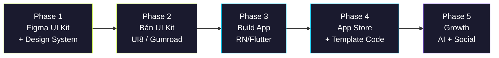

# 🔥 FORGE AI — Chiến Lược Tổng Thể

> **Tài liệu này tổng hợp + đánh giá phê phán 3 bản phân tích (GPT, Claude, Grok), rồi chốt chiến lược cuối cùng.**

---

## Phần 1: Đánh Giá 3 Bản Phân Tích

### 📊 Ma trận so sánh

| Tiêu chí                    |    GPT     |   Claude   |    Grok    |
| --------------------------- | :--------: | :--------: | :--------: |
| **Độ sâu phân tích**        | ⭐⭐⭐⭐⭐ |  ⭐⭐⭐⭐  |   ⭐⭐⭐   |
| **Tính thực tế (solo dev)** | ⭐⭐⭐⭐⭐ |   ⭐⭐⭐   |    ⭐⭐    |
| **Chiến lược go-to-market** | ⭐⭐⭐⭐⭐ |  ⭐⭐⭐⭐  |   ⭐⭐⭐   |
| **Ý tưởng tính năng độc**   | ⭐⭐⭐⭐⭐ |  ⭐⭐⭐⭐  | ⭐⭐⭐⭐⭐ |
| **Tư duy UX/Retention**     | ⭐⭐⭐⭐⭐ |   ⭐⭐⭐   |   ⭐⭐⭐   |
| **Chiến lược marketplace**  |  ⭐⭐⭐⭐  | ⭐⭐⭐⭐⭐ |   ⭐⭐⭐   |
| **Phân tích rủi ro**        |  ⭐⭐⭐⭐  |  ⭐⭐⭐⭐  |   ⭐⭐⭐   |

---

### 🏆 GPT — "Chiến lược gia kinh doanh"

**Chiến lược**: Không bán bài tập, bán **cảm giác được theo sát**. Multi-agent system + "Today" screen là trung tâm.

#### Điểm mạnh (nên lấy)

| #   | Insight                              | Tại sao hay                                                                 |
| --- | ------------------------------------ | --------------------------------------------------------------------------- |
| 1   | **"Today" screen trả lời 5 câu hỏi** | UX thinking cực sâu — user mở app = biết ngay phải làm gì                   |
| 2   | **Mood-to-Workout Engine**           | Chưa ai làm, dễ viral TikTok, pain point thật                               |
| 3   | **Anti-Quit Flow**                   | Retention weapon thật sự — không hỏi "tại sao bỏ" mà hỏi "muốn giảm không?" |
| 4   | **Quiet Mode for Apartments**        | Pain point cực thực tế VN — chung cư/phòng trọ                              |
| 5   | **Frictionless Fallback**            | 6p, 12p, mobility only, no-jump — user không bao giờ "thất bại"             |
| 6   | **Template-first → Product-first**   | Giảm rủi ro tài chính — kiếm tiền từ UI kit trước khi build app thật        |
| 7   | **Ghost Mode / Future Self**         | Projected progress nếu giữ streak vs. bỏ — motivation gamification          |
| 8   | **Brand "wellness premium"**         | Không toxic gym bro, mà intelligent wellness — mở rộng tệp user             |

#### Điểm yếu

- Đề xuất Flutter thay vì RN — **tùy tech stack bạn đang mạnh**
- Hơi dài, một số phần lặp ý
- Không đề cập cost AI chi tiết

> **Verdict**: GPT có **tư duy sản phẩm sâu nhất**. Hiểu rõ rằng fitness app chết vì retention, không phải vì features. Phần "Today" screen + Anti-Quit + Mood Engine đáng giá nhất.

---

### 🧠 Claude — "Kiến trúc sư kỹ thuật"

**Chiến lược**: "FORJA" — AI Agent Coach đầu tiên cho home gym. Focus tech specs + market gap.

#### Điểm mạnh (nên lấy)

| #   | Insight                           | Tại sao hay                                           |
| --- | --------------------------------- | ----------------------------------------------------- |
| 1   | **Gap Analysis rõ ràng**          | 4 yếu tố chưa ai kết hợp = blue ocean rõ ràng         |
| 2   | **Tech Stack chi tiết**           | Architecture diagram + stack đầy đủ, production-ready |
| 3   | **60+ Screen Map**                | Chia rõ từng flow, đủ cho marketplace listing         |
| 4   | **5 Revenue Streams**             | Subscription + Template + Affiliate + IAP + B2B       |
| 5   | **ThemeForest Compliance**        | Checklist chuẩn marketplace — từ KI đã verify         |
| 6   | **Competitive Positioning Chart** | Quadrant chart trực quan — FORJA chiếm blue ocean rõ  |
| 7   | **Phase roadmap rõ ràng**         | MVP 8w → AI Agent 6w → CV 6w → Social 4w → Launch 4w  |

#### Điểm yếu

- Ít tư duy UX/retention (so với GPT)
- Scope hơi tham — CV + AR + Gamification + Nutrition cho 1 solo dev
- Tên "FORJA" → phải check trademark

> **Verdict**: Claude mạnh nhất về **kiến trúc kỹ thuật + marketplace strategy**. Screen map + tech stack + compliance checklist = nền tảng vững. Nhưng thiếu depth về UX psychology.

---

### ⚡ Grok — "Visionary táo bạo"

**Chiến lược**: "HomeForge AI" — AI Home Improviser. Highlight: Object Detection biến đồ trong nhà thành dụng cụ tập.

#### Điểm mạnh (nên lấy)

| #   | Insight                    | Tại sao hay                                                                     |
| --- | -------------------------- | ------------------------------------------------------------------------------- |
| 1   | **AI Home Improviser**     | "Chai nước = dumbbell, ghế sofa = step" — **ý tưởng viral nhất trong cả 3 bản** |
| 2   | **Narrative Gamification** | Workout thành quest RPG — unique angle                                          |
| 3   | **On-device privacy**      | MediaPipe local = privacy-first = trust                                         |
| 4   | **Giá VNĐ thực tế**        | 149k-299k/tháng — hiểu thị trường VN                                            |

#### Điểm yếu

- **Bản ngắn nhất** — thiếu depth ở mỗi mục
- Không có UX wireframe flow
- Roadmap quá lạc quan (MVP 2-3 tháng cho solo dev với AI + CV)
- "Narrative gamification" nghe hay nhưng rất tốn resource implement
- Đề xuất Grok API cho AI layer — bias bản thân

> **Verdict**: Grok có **1 ý tưởng killer** (Object Detection → biến đồ nhà thành gym) mà 2 bản kia không có. Nhưng tổng thể thiếu chiều sâu và quá lạc quan về timeline.

---

## Phần 2: Tôi Thích Chiến Lược Nào Nhất?

### 🥇 GPT chiến thắng về chiến lược tổng thể.

**Lý do:**

1. **Hiểu đúng cuộc chơi**: Fitness app chết vì user bỏ, không phải vì thiếu features. GPT focus 100% vào retention.
2. **Thực tế cho solo dev**: Template-first → Product-first = kiếm tiền sớm, validate market, giảm rủi ro.
3. **UX psychology sâu**: "Today" screen, Anti-Quit, Mood Engine, Fallback Mode — mỗi cái giải quyết 1 pain point thật.
4. **Brand strategy đúng**: "Wellness premium" mở rộng tệp hơn "gym bro AI".
5. **Tính năng vừa đủ cho MVP**: Không ôm hết, biết cut scope.

### 🥈 Claude — runner-up, vững về execution

Tech stack + marketplace checklist + screen map là backbone không thể thiếu. Nhưng think like engineer, not like product manager.

### 🥉 Grok — wild card, 1 good idea

Object Detection biến đồ nhà thành gym = viral hook. Nhưng bản phân tích quá mỏng để dựa vào làm chiến lược.

---

## Phần 3: Chiến Lược Hợp Nhất — "Best of All Three"

> Lấy **GPT làm xương sống** (product thinking + retention), **Claude làm cơ sở hạ tầng** (tech + marketplace), **Grok thêm gia vị** (Object Detection viral hook).

---

### 3.1 Định vị sản phẩm

> **"The first home gym app that adapts to your real life — not the other way around."**

- Không bán bài tập. Bán **cảm giác duy trì tự nhiên**.
- AI không chỉ lập kế hoạch, mà **tự hành động** khi bạn không mở app.
- Premium wellness, không toxic gym culture.

---

### 3.2 Tính năng — Chia 3 tier

#### 🎯 Tier 1: MVP (Bản UI Kit + App v0.1) — 8-10 tuần

| Feature                             | Nguồn ý tưởng | Tại sao có ở MVP                                |
| ----------------------------------- | :-----------: | ----------------------------------------------- |
| **"Today" Dashboard**               |      GPT      | 1 screen quyết định user tập hay đóng app       |
| **Agentic Daily Plan**              |     Cả 3      | USP cốt lõi — AI chọn buổi tập dựa trên context |
| **Equipment Inventory** (manual)    |    Claude     | Biết user có gì → generate đúng bài             |
| **Mood-to-Workout**                 |      GPT      | Chọn mood → AI sinh workout phù hợp             |
| **Fallback Mode** (6p/12p/mobility) |      GPT      | User không bao giờ "fail"                       |
| **Quiet Mode** (apartment)          |      GPT      | Pain point VN/Asia                              |
| **Workout Player**                  |     Cả 3      | Core experience                                 |
| **Progress Tracking** (basic)       |     Cả 3      | Streak, XP, weekly ring                         |
| **Readiness Check**                 |      GPT      | "Hôm nay bạn sẵn sàng tập tới đâu?"             |
| **Anti-Quit Flow**                  |      GPT      | Retention weapon #1                             |
| **Onboarding Wizard**               |     Cả 3      | First impression = install or delete            |
| **Paywall Premium**                 |      GPT      | Revenue gate                                    |

#### 🔄 Tier 2: v1.0 (App Store ready) — thêm 6-8 tuần

| Feature                                       |    Nguồn    |
| --------------------------------------------- | :---------: |
| **AI Weekly Review**                          |     GPT     |
| **Ghost Mode / Future Self**                  |     GPT     |
| **AI Home Improviser** (Object Detection)     |    Grok     |
| **Camera Rep Counter** (basic)                | Claude/Grok |
| **AI Recovery Tradeoff Slider**               |     GPT     |
| **Nutrition (Photo-to-Macro)**                |   Claude    |
| **Wearable Sync** (Apple Health / Google Fit) |    Cả 3     |

#### 🚀 Tier 3: v2.0 (Growth) — sau launch

| Feature                                   |    Nguồn    |
| ----------------------------------------- | :---------: |
| **AI Form Coach** (full skeleton overlay) |   Claude    |
| **Social Circles** (co-train 1-3 người)   |     GPT     |
| **AR Room Scan**                          | Claude/Grok |
| **Narrative Gamification** (quest RPG)    |    Grok     |
| **Voice Coach realtime**                  |   Claude    |
| **B2B White-label**                       |   Claude    |

---

### 3.3 UI/UX Strategy

#### Design Language: **"Dark Cinematic Wellness"**

| Token            | Value                                                 |
| ---------------- | ----------------------------------------------------- |
| **Theme**        | Dark-first (OLED-optimized) + Light secondary         |
| **Primary**      | Electric Lime `hsl(72, 89%, 57%)` — energy            |
| **Secondary**    | Cool Cyan `hsl(192, 100%, 50%)` — intelligence        |
| **Mood Accents** | Coral (fat loss), Violet (recovery), Icy Blue (sleep) |
| **Background**   | `hsl(240, 33%, 3%)` → `hsl(240, 16%, 13%)` gradient   |
| **Glass**        | `hsla(0, 0%, 100%, 0.05)` + blur(20px) + 1px glow     |
| **Typography**   | Inter (body) + Space Grotesk (headings)               |
| **Icons**        | Phosphor Icons (duotone)                              |
| **Spacing**      | 8px grid                                              |
| **Radius**       | 16px cards, 12px buttons, 24px bottom sheets          |
| **Motion**       | Spring-based, breathing feel, haptic feedback         |

#### Screen Count Target (cho marketplace)

| Category                  | Screens          |
| ------------------------- | ---------------- |
| Onboarding                | 5                |
| Dashboard                 | 1 (multi-widget) |
| Workout Flow              | 8                |
| Planning                  | 4                |
| Progress                  | 6                |
| Nutrition                 | 5                |
| Profile / Settings        | 6                |
| Social / Gamification     | 5                |
| AI Chat                   | 2                |
| **Paywall variants**      | **3**            |
| **Dashboard variants**    | **4**            |
| **App Store Screenshots** | **6**            |
| **TOTAL**                 | **55+**          |

---

### 3.4 Go-to-Market: Template-First

> Chiến lược GPT đề xuất, vốn = 0, rủi ro thấp nhất.



| Phase | Output                                                          | Revenue           | Timeline         |
| ----- | --------------------------------------------------------------- | ----------------- | ---------------- |
| **1** | Figma UI Kit (55+ screens, design system, dark/light)           | —                 | 3-4 tuần         |
| **2** | Bán trên **UI8** ($49-69) + Gumroad + Behance/Dribbble showcase | 💰 Passive        | Ngay sau Phase 1 |
| **3** | Build app prototype (RN Expo hoặc Flutter)                      | —                 | 8-10 tuần        |
| **4** | App Store + Play Store + Bán template code ($59-89)             | 💰 Sub + Template | 4 tuần           |
| **5** | AI Form Coach, Social, Growth features                          | 💰 Scale          | Ongoing          |

---

### 3.5 Monetization

| Tier              | Giá                                             | Tính năng                                               |
| ----------------- | ----------------------------------------------- | ------------------------------------------------------- |
| **Free**          | $0                                              | 3 workouts/tuần, basic tracking, limited exercises      |
| **Pro**           | $6.99/tháng ($39.99/năm) — hoặc 149k VNĐ/tháng  | Full AI planning, mood engine, nutrition, unlimited     |
| **Elite**         | $12.99/tháng ($79.99/năm) — hoặc 299k VNĐ/tháng | AI Form Coach, voice coaching, Future Self, priority AI |
| **UI Kit**        | $49–69 (one-time, UI8)                          | Figma file, 55+ screens, design system                  |
| **Code Template** | $59–89 (one-time, CodeCanyon)                   | Full source code, demo app, docs                        |

**Revenue khác:**

- Affiliate: đề xuất mua dụng cụ → Amazon/Shopee Associates
- In-App: premium challenges, avatar items

---

### 3.6 Tech Stack (chốt)

```
📱 Frontend
├── React Native + Expo (SDK 53+) hoặc Flutter
├── TypeScript strict
├── File-based routing
├── Reanimated 3 / Skia (charts)
└── Expo Camera + MediaPipe

🧠 AI Layer
├── Hybrid approach (KHÔNG dùng LLM cho mọi thứ)
│   ├── Rules + Scoring → Readiness, plan adaptation
│   ├── LLM (GPT-4o/Claude) → Coaching language, explanations
│   └── TFLite/MediaPipe → Form check, rep count (on-device)
└── Caching strategy → giảm API cost

☁️ Backend
├── Supabase (Auth, DB, Realtime, Storage)
├── Edge Functions
└── RevenueCat (subscription management)

📊 Analytics
├── PostHog (product analytics)
├── D1/D7/D30 retention tracking
└── Workout completion rate
```

---

### 3.7 Rủi Ro & Mitigation

| Rủi ro                              | Mức | Giải pháp                                                           |
| ----------------------------------- | :-: | ------------------------------------------------------------------- |
| AI API cost cao                     | 🔴  | On-device ML + aggressive caching + rules engine cho logic đơn giản |
| Computer Vision chưa mature         | 🟡  | Tier 2 mới thêm, MVP không cần                                      |
| Solo dev → scope creep              | 🔴  | Strict tier system, max 1 tier/phase                                |
| App Store rejection (health claims) | 🟡  | "Fitness guidance" không phải "medical advice" — disclaimer rõ      |
| UI Kit không bán được               | 🟢  | Vốn = 0, chỉ tốn thời gian. Behance/Dribbble showcase = portfolio   |

---

## Phần 4: Kết Luận

### Tại sao chiến lược này "peak"

1. **Vốn = 0**: Figma + showcase trước, kiếm tiền trước khi code
2. **Ít cạnh tranh**: Home gym + Agentic AI + Object Detection = blue ocean
3. **Retention-first**: Mọi feature phục vụ "user tập thêm 1 ngày nữa"
4. **Dual-revenue**: Cùng 1 design = bán UI kit + bán subscription
5. **Solo-friendly**: Tier system nghiêm ngặt, không ôm quá nhiều

### Hành động tiếp theo

1. **Chốt tên** — FORJA / HomeForge / Forge Fit / tên khác?
2. **Chọn tech stack** — React Native (Expo) hay Flutter?
3. **Bắt đầu Phase 1** — Figma Design System + 55 screen UI Kit

---

> _Tài liệu này là "living document" — sẽ update khi có quyết định mới._
